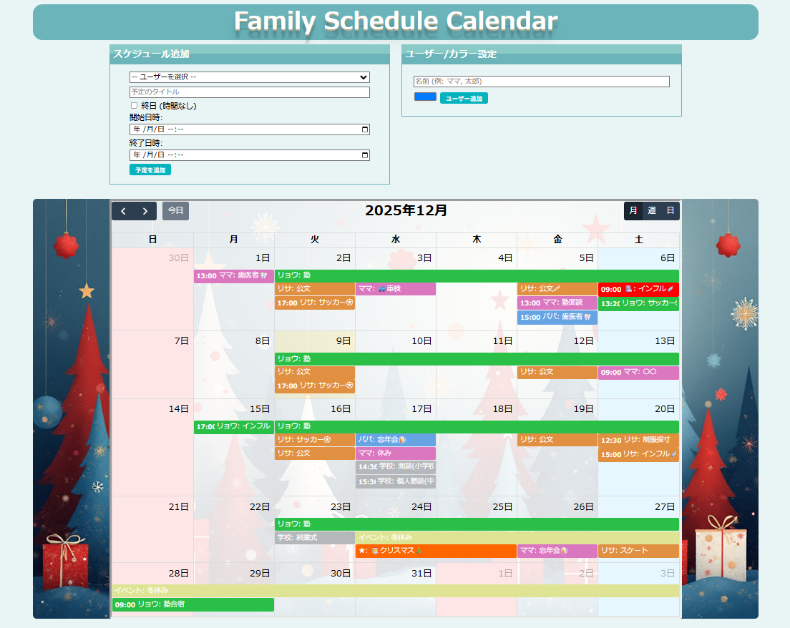
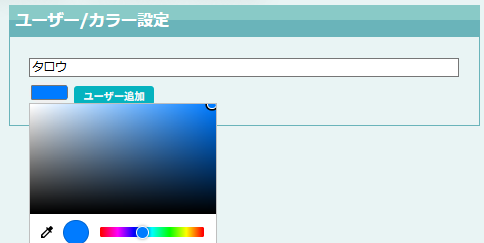
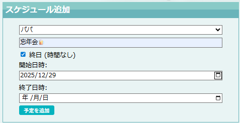
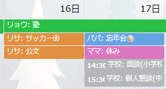
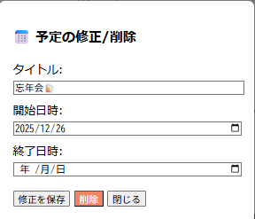

## 1.LPのタイトル
ファミリースケジュールカレンダー

## 2.制作LPの説明（40文字程度）
(初期設定)ユーザ登録／カラー指定が必要

(予定追加)ユーザごとに指定日時に予定を登録できる

(データ表示)登録したスケジュールをカレンダー上に表示する

(編集)カレンダー上の予定に対する修正削除ができる

## 3.工夫した点・こだわった点 
・fullcalendarを使った

・レスポンシブ対応

・時間を入れなくてもスケジュールを登録できるようにした

・fullcalendarの性質？により同日のスケジュールが重なってしまったが分ける処理をいれることで解消

・土日祝日の色、月単位で背景画像を変更

## 4.次回トライしたこと（または機能）
・カレンダーやモーダルウィンドウの装飾ができなかったので装飾する

・カレンダーの1日に複数行となった場合の可変？対応or「more」対応

・ユーザ削除を行うとどうなるか等の検証

・レスポンシブ対応にすることで力枠が広くなったので見た目良く調整したい

・複数日に予定を登録する、予定をコピペできるようにする

・スケジュール追加ではなく、カレンダーの日付を選んで直接スケジュール追加できる

## 5.備考（感想、シェアしたいこと等なんでも） 
・カレンダーのなかで様々な処理(折り返し、more)ができることを知った

・レスポンシブ対応をもっと知る